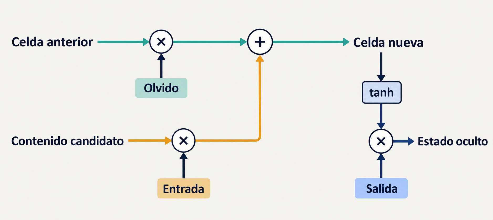
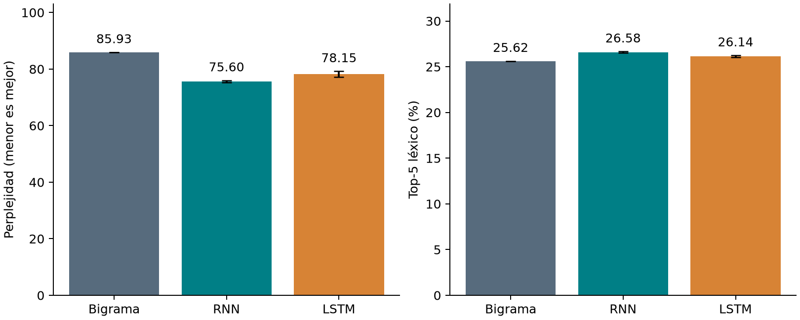
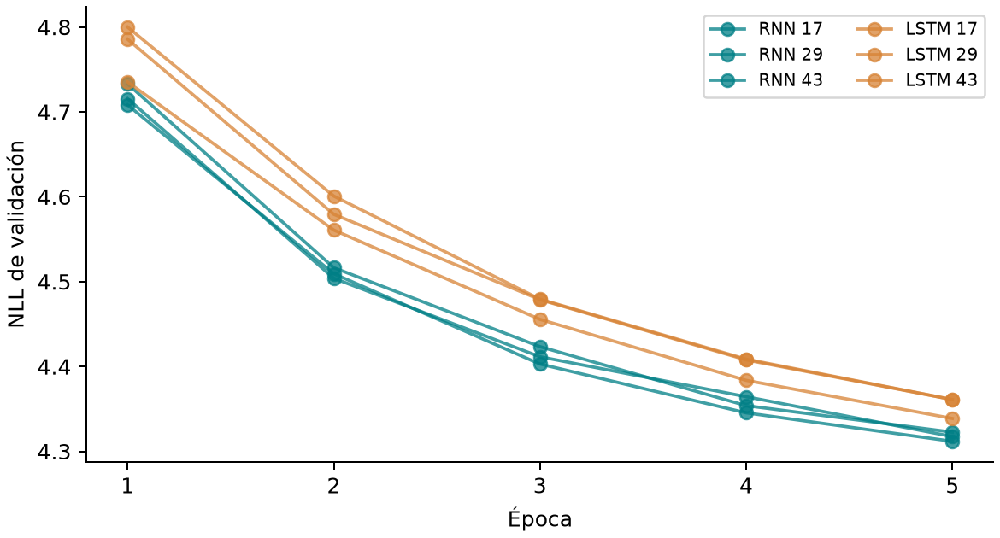

# Deep learning en PLN - RNN y LSTM

**Evaluación de la actividad, aprendizaje de la investigación y uso de los recursos**

Grupo 5. Base de Conocimiento, Ingeniería en Software, ESPOCH. Revisión: 2 de octubre de 2026. Entrega indicada: 6 de octubre de 2026.

## 1. Parámetros generales y formato del informe

### Encargo académico y alcance del grupo 5

La actividad solicita estudiar **Deep learning en PLN - RNN y LSTM**. En concreto, pide investigar la arquitectura de las redes neuronales recurrentes y el manejo de memoria mediante LSTM. Su aplicación propuesta es un programa que prediga la siguiente palabra de un texto.

El objetivo formativo une dos trabajos: comprender la teoría y demostrarla mediante una implementación en Python. Para el grupo 5, eso significa explicar cómo funcionan RNN y LSTM, construir el autocompletado, medir sus resultados y defender las decisiones tomadas.

Esta guía comienza evaluando las seis secciones de las instrucciones originales. Después presenta las doce fuentes y desarrolla el aprendizaje en orden. Las tecnologías, los archivos y los procedimientos de ejecución aparecen al final, cuando ya se conoce su propósito.

### Criterios utilizados en esta evaluación

| Estado | Significado |
|---|---|
| Verificado | Existe una evidencia concreta que satisface el aspecto indicado. |
| Parcial | Una parte está realizada y otra condición sigue pendiente. |
| Pendiente | El producto o la acción requerida todavía no existe o no se ha realizado. |
| No acreditado | No hay evidencia suficiente para afirmar cumplimiento. |

**Resultado general:** el contenido de investigación y el prototipo están desarrollados. La actividad completa todavía no puede declararse lista para entregar. Existen condiciones pendientes de publicación, Overleaf, extensión, bibliografía y autoría. Cada una se identifica abajo, sin convertir la existencia de un archivo en una prueba de cumplimiento total.

### Evaluación de los siete parámetros de la sección 1

| Instrucción | Evidencia del trabajo y justificación | Evaluación |
|---|---|---|
| Organización en seis grupos | El trabajo identifica al grupo 5 y estudia RNN/LSTM con predicción de la siguiente palabra. No intenta desarrollar los proyectos de los otros cinco grupos. | Verificado para el grupo 5. La coordinación entre grupos corresponde a la clase. |
| LaTeX y plantilla oficial, texto en español | El informe tiene fuentes `.tex`, usa la clase `acmart` y conserva el formato `sigconf`. El cuerpo está en español y contiene el abstract adicional en inglés exigido. | Verificado localmente. |
| Entre 18 y 20 páginas técnicas | El PDF actual tiene 22 páginas totales. Las referencias comienzan en la página 21. Es una versión ampliada de revisión solicitada posteriormente. | Pendiente de ajuste y de criterio de cómputo. No se certifica el límite con el total actual. |
| Entre 10 y 15 referencias indexadas, con BibTeX | Hay 12 entradas en `referencias.bib` y citas en el texto. Se identificaron publicaciones reales y copias abiertas. También se usaron canales distintos de IEEE, Springer y ScienceDirect. | Cantidad y BibTeX verificados. Elegibilidad bibliográfica completa no acreditada. |
| Notebook o scripts Python documentados y publicados | Existen scripts `.py`, comentarios, pruebas y modelos. La opción `.py` satisface el formato, sin necesidad de un notebook adicional. No hay repositorio publicado. | Parcial: implementación sí, publicación no. |
| URL de presentación y repositorio al final | Existe la sección «Enlaces a recursos», pero explica que las URL definitivas faltan. Un texto de pendiente no sustituye un enlace. | Pendiente. |
| PDF compilado en Overleaf y entrega en aula virtual | Existe PDF compilado con TinyTeX en este equipo y ZIP de fuentes listo para importar. No existe evidencia de compilación en Overleaf ni comprobante de entrega. | Parcial en preparación. Overleaf y entrega pendientes. |

### Comprobación de la plantilla suministrada

Se abrió `Template_ovearleafe_2026_2s (1).zip` y se compararon sus archivos con los utilizados en el informe. El resultado del 2 de octubre fue:

| Archivo | Función | Comparación |
|---|---|---|
| `acmart.cls` | Define el formato general del documento ACM. | Idéntico, byte por byte, al ZIP suministrado. |
| `ACM-Reference-Format.bst` | Define cómo BibTeX presenta las referencias. | Idéntico, byte por byte, al ZIP suministrado. |

El archivo principal es `informe/main.tex`. Usa `sigconf` y `nonacm`: mantiene el formato de conferencia y omite información editorial de una publicación ACM que este trabajo de clase no tiene. Se añadieron idioma, autores, contenido y configuración para fragmentos de código. No se alteraron la clase ni el estilo bibliográfico originales.

**Límite de esta comprobación:** demostrar el origen de la clase y del estilo no demuestra por sí solo que todos los requisitos de contenido, extensión o entrega estén satisfechos. El procedimiento para importar y revisar el documento aparece en el capítulo 19.

## 2. Estructura obligatoria del informe

### Correspondencia entre los ocho apartados y el contenido elaborado

La sección 2 de las instrucciones exige ocho componentes. El informe distribuye algunos en más de una sección para desarrollar el tema, pero eso no elimina ninguno de los componentes pedidos.

| Apartado solicitado | Desarrollo realizado y fundamento | Evaluación |
|---|---|---|
| Abstract en español e inglés | Ambos resúmenes presentan tarea, corpus, comparación, tamaño de prueba, principales resultados y limitaciones. Las cifras proceden de la evaluación local. | Verificado en `main.tex` y primera página del PDF. |
| Introducción e importancia | Explica PLN, predicción de palabra, utilidad para escritura, objetivos, pregunta de comparación y alcance. Bengio 2003 y Mikolov 2010 fundamentan modelos de lenguaje y aplicaciones. | Verificado en `01_introduccion.tex`. |
| Marco teórico y bibliotecas | Define representación, aprendizaje, RNN, celda y compuertas LSTM. Explica PyTorch, NumPy, Matplotlib y biblioteca estándar. Las fuentes se presentan en el capítulo 7 de esta guía. | Verificado. Conceptos en secciones 2 y 3 del informe; bibliotecas en sección 5. |
| Metodología y desarrollo práctico | Describe corpus, normalización, partición documental, vocabulario, ventanas, entrenamiento y selección. Explica el código y recorre una predicción real. | Verificado en secciones 4, 5 y 6 del informe. |
| Resultados y discusión técnica | Incluye comparación principal, semillas, historial, contextos, parámetros, tiempos y sugerencias. Interpreta perplejidad, aciertos y cobertura sin afirmar superioridad general. | Verificado en sección 7 y archivos de resultados. |
| Conclusiones | Responde al objetivo: mecanismos implementados, RNN con mejores medias bajo este protocolo y límites del vocabulario. Distingue extensiones propuestas de experimentos realizados. | Verificado en sección 8. |
| Enlaces a recursos | El encabezado existe, pero las direcciones de presentación y repositorio no están publicadas. El enlace al corpus no reemplaza esas dos URL. | Pendiente de cumplimiento material. |
| Referencias BibTeX | Doce registros bibliográficos generan las referencias y se relacionan con citas del texto. El catálogo abierto permite localizar los documentos. | Mecanismo verificado. Véase la limitación de elegibilidad del capítulo 1. |

### Relación entre afirmaciones, fuentes y resultados

- **Afirmación teórica:** «Una LSTM utiliza celda y compuertas». Se respalda con la literatura sobre LSTM y su implementación.
- **Decisión de método:** «El vocabulario tiene 3000 entradas». Se respalda con la configuración y los datos del programa.
- **Resultado medido:** «La RNN obtuvo perplejidad media 75,60». Se respalda con los registros del experimento.

Los artículos no contienen nuestros resultados locales. Las fuentes fundamentan el método y los conceptos; el programa y sus salidas fundamentan las cifras propias. Esta separación permite comprobar el informe sin atribuir a un autor datos que nunca publicó.

### Correspondencia con los archivos de redacción

| Archivo dentro de `informe/secciones/` | Contenido |
|---|---|
| `01_introduccion.tex` | Problema, importancia, objetivos y alcance. |
| `02_fundamentos.tex` | Conceptos necesarios para estudiar el modelo. |
| `03_rnn_lstm.tex` | Recurrencia y memoria LSTM. |
| `04_metodologia.tex` | Datos y protocolo experimental. |
| `05_desarrollo.tex` | Bibliotecas y explicación del programa. |
| `05b_recorrido.tex` | Una consulta desde palabras hasta sugerencias. |
| `06_resultados.tex` | Tablas, figuras y discusión. |
| `07_conclusiones.tex` | Conclusiones y estado de los recursos. |

La numeración del nombre de archivo organiza la redacción. La numeración visible de secciones la genera LaTeX. Los archivos antiguos `contenido.tex`, `recursos.tex` y `tabla_resultados.tex` no forman parte de los ocho archivos incluidos por el `main.tex` vigente.

## 3. Directrices para la presentación y la defensa

### Evaluación de las instrucciones de exposición

| Instrucción | Preparación existente | Evaluación |
|---|---|---|
| Entre 10 y 12 diapositivas | La presentación vigente tiene 12 diapositivas, incluidas portada y conclusiones. | Verificado por conteo del PPTX. |
| Enlace a la presentación en el informe | El archivo se comparte localmente, pero no hay URL definitiva incorporada. | Pendiente. |
| Exposición entre 30 y 40 minutos | Las notas y el guion distribuyen 35 minutos. Es una duración prevista, no un ensayo cronometrado. | Planificado; duración real no acreditada. |
| Demostración práctica en vivo | Hay programa interactivo y modelos locales. La consulta de referencia se ejecutó correctamente. El guion reserva cinco minutos. | Preparación verificada; ejecución ante el docente pendiente. |
| Todos deben dominar cualquier parte | Se prepararon explicaciones, preguntas y distribución orientativa. No hay evidencia de que los seis integrantes hayan demostrado dominio. | No acreditado todavía. |

### Cobertura de las doce diapositivas

| Diapositivas | Tema explicado | Tiempo previsto |
|---|---|---|
| 1 y 2 | Tema, problema y utilidad del autocompletado. | 4 minutos |
| 3 y 4 | Funcionamiento de RNN y memoria LSTM. | 7 minutos |
| 5 y 6 | Datos y recorrido por el código. | 6 minutos |
| 7 y 8 | Protocolo y significado de las métricas. | 5 minutos |
| 9 y 10 | Resultados, aprendizaje y limitaciones. | 6 minutos |
| 11 y 12 | Demo y conclusiones. | 7 minutos |
| Total | Incluye cinco minutos de demo. | 35 minutos |

La presentación tiene tablas y gráficos editables. Su esquema de memoria es una ilustración explicativa. Las notas contienen la procedencia de las cifras y fuentes. La revisión local no equivale a una prueba de proyección en el aula o de apertura en PowerPoint de escritorio.

### Estado de los cuatro entregables resumidos por el docente

- **Informe técnico:** desarrollado como versión ampliada; faltan ajustes y validaciones institucionales indicados en el capítulo 1.
- **Presentación:** archivo preparado; falta publicación con enlace y ensayo.
- **Código:** funcional en las comprobaciones locales; falta repositorio publicado.
- **Defensa:** guion y demo preparados; debe realizarse y demostrarse el dominio de todos.

## 4. Tema asignado dentro de los seis grupos

### Distribución completa de la actividad

La guía docente presenta seis grupos para cubrir el proceso de PLN. Esta tabla conserva todos los temas y ejemplos y explica por qué el informe se concentra en el quinto.

| Grupo | Investigación y ejemplo solicitados | Relación con nuestro trabajo |
|---|---|---|
| 1 | Niveles fonológico, morfológico, sintáctico y semántico; ambigüedad. Ejemplo: POS y dependencias con spaCy. | Contexto de la materia. No corresponde implementar ese analizador en el grupo 5. |
| 2 | Tokenización, lematización, stemming y ruido. Ejemplo: limpieza de redes sociales. | Nuestra normalización prepara entradas, pero no desarrolla el proyecto de redes sociales. |
| 3 | Bag of Words, TF-IDF y embeddings Word2Vec/GloVe, ventajas y límites. Ejemplo: buscador y comparación de representaciones. | Necesitamos explicar nuestro embedding aprendido. No se pidió al grupo 5 construir ese buscador. |
| 4 | Clasificación supervisada, sentimientos y métricas como accuracy y F1. Ejemplo: reseñas de comercio electrónico. | Nuestro objetivo es la siguiente palabra, no una etiqueta de sentimiento. |
| 5 | Arquitectura de RNN y memoria en secuencias con LSTM. Ejemplo: autocompletado de la siguiente palabra. | Es el tema desarrollado en el informe y en el programa. |
| 6 | Atención, Transformer, BERT y GPT. Ejemplo: traducción o resumen. | No se implementaron esas tareas porque pertenecen a otro grupo. |

### Evaluación de los cuatro componentes comunes exigidos

| Componente | Justificación específica del grupo 5 | Estado |
|---|---|---|
| Definición teórica | Se explican arquitectura recurrente, estado, celda, compuertas y aprendizaje. | Desarrollado. |
| Utilidad en la industria | Se describe apoyo a escritura y se cita modelado de lenguaje para reconocimiento del habla como aplicación de la literatura. | Desarrollado como utilidad potencial; no se afirma despliegue industrial propio. |
| Funcionalidades de bibliotecas | Se relacionan capas y entrenamiento con PyTorch, matrices con NumPy y gráficas con Matplotlib. | Desarrollado. |
| Ejemplo práctico sugerido | Un script recibe un contexto en español y devuelve cinco candidatas a la siguiente palabra. | Implementado y probado localmente. |

**Conclusión de alcance:** RNN, LSTM y el autocompletado sí corresponden a la actividad asignada. El bigrama se añadió como referencia de comparación: ayuda a juzgar si las redes aportan una mejora. No sustituye el tema solicitado.

## 5. Rúbrica de evaluación

### Evidencia frente a los tres criterios

| Criterio y valor | Evidencia disponible | Condición que sigue abierta |
|---|---|---|
| Fondo: 1,0 punto | Desarrollo teórico, doce fuentes, código, diez entrenamientos finales, tablas y pruebas locales. | La profundidad y corrección final las evalúa el docente. Un resultado de prueba del software no asigna la nota. |
| Forma: 1,0 punto | Clase oficial, contenido en LaTeX y bibliografía BibTeX. | Resolver extensión y elegibilidad de fuentes; completar las URL y compilar en Overleaf. |
| Defensa: 1,0 punto | Doce diapositivas, guion de 35 minutos y programa de demo. | Ensayar, comprobar la duración y demostrar el dominio de los integrantes en vivo. |
| Total: 3,0 puntos | Los materiales permiten preparar los tres criterios. | No existe calificación emitida ni garantía de obtener los tres puntos. |

La rúbrica combina producto escrito, funcionamiento y comprensión. Por eso un informe extenso, por sí solo, no acredita toda la actividad. La explicación de los capítulos siguientes busca que el grupo pueda relacionar cada concepto con el programa y con una evidencia concreta.

## 6. Política de integridad académica y uso de IA

### Evaluación de todas las condiciones de la sección 6

| Condición del docente | Situación de este trabajo | Evaluación |
|---|---|---|
| Limitar IA a consulta, estructura o revisión gramatical | La asistencia produjo redacción extensa, código y materiales. Su alcance excedió esas funciones limitadas. | La versión asistida no cumple esa restricción tal como está redactada. |
| Máximo 10 % de contenido generado por IA | No existe una medición acreditada ni base para declarar que el texto actual está por debajo de ese límite. | No acreditado. No debe presentarse como cumplimiento automático. |
| Análisis con Compilatio y anulación si supera 10 % | No se ha ejecutado una revisión institucional. La guía establece consecuencia de 0 si supera el límite. | Condición y consecuencia comunicadas; no se predice el resultado del detector. |
| Parafraseo, análisis crítico y aporte propio | Se proporcionaron materiales de revisión. No se registraron aportes comprobados de cada integrante. | Pendiente de trabajo real del grupo. Parafrasear por sí solo no demuestra aporte ni porcentaje. |
| Código público, funcional y reproducible | Hay código, datos, versiones, pruebas y mecanismo de réplica. Falta publicación. No se ha verificado una réplica en otro equipo. | Parcial. |
| Explicar y ejecutar el código en vivo | La ejecución local está comprobada. No se ha evaluado a los integrantes explicándolo. | Dominio y defensa no acreditados. |
| Referencias reales y que respalden las afirmaciones | Hay publicaciones identificables, copias abiertas y pasajes pertinentes. Esta guía distingue teoría, ejemplos y mediciones. | Verificación documental disponible, sin sustituir el criterio bibliográfico del capítulo 1. |
| Todos defienden cualquier parte del informe y código | Existen material de aprendizaje y preguntas de preparación. | Debe comprobarse mediante ensayo y defensa de todos. |

### Conclusión de la evaluación inicial

**No sería correcto afirmar que no falta nada.** El tema, el contenido y el prototipo están desarrollados, pero la entrega institucional conserva los pendientes identificados. Esta guía los expone para que el grupo tome decisiones con información verificable.

Las menciones «Página 1 de 4» a «Página 4 de 4» y «Isaac Torres» del archivo de instrucciones son marcas de paginación y autoría de la guía docente. No son instrucciones para copiar esos pies en nuestro informe. Se consideraron al leer el documento completo.

La siguiente parte comienza por las fuentes porque primero es necesario saber de dónde sale la explicación. Después avanza desde PLN hasta los resultados. Las instrucciones técnicas se reservan para el final.

## 7. Fuentes de la investigación y función de cada una

### Criterio de selección y lectura

Se seleccionaron doce publicaciones académicas. Una está en español. Para los conceptos centrales se conservaron originales en inglés con acceso completo gratuito, en lugar de sustituirlos por resúmenes sin respaldo.

Las copias se descargaron y verificaron el 29 de septiembre de 2026. Cada ficha siguiente indica **qué información aporta, para qué se utiliza y qué no permite afirmar**. Los nombres cortos S1 a S12 son identificadores de lectura de esta guía, no el orden numérico de la bibliografía ACM.

### S1. Doval, Gómez-Rodríguez y Vilares, 2016

**Título:** Segmentación de palabras en español mediante modelos del lenguaje basados en redes neuronales. Publicación: Procesamiento del Lenguaje Natural, 57, 75–82.

- **Información clave:** presenta redes recurrentes y el papel de celda y compuertas LSTM en español.
- **Uso en el trabajo:** antecedente accesible para leer la terminología de recurrencia y memoria.
- **Pasaje:** sección 3.1, páginas impresas 77–78, páginas 4–5 del PDF con portada.
- **Límite:** su tarea recupera separaciones entre palabras a partir de caracteres. No es nuestro autocompletado por palabras.

[Leer el texto completo en Redalyc](https://www.redalyc.org/pdf/5157/515754424008.pdf).

### S2. Bengio, Simard y Frasconi, 1994

**Título:** Learning long-term dependencies with gradient descent is difficult. Publicación: IEEE Transactions on Neural Networks, 5(2), 157–166.

- **Información clave:** explica dificultades para aprender dependencias lejanas mediante cambios de parámetros guiados por gradientes.
- **Uso:** fundamenta por qué una RNN puede tener dificultades con información de posiciones distantes.
- **Pasaje:** resumen y desarrollo sobre almacenamiento de información y gradientes. La copia académica tiene su propia paginación.
- **Límite:** no demuestra que toda RNN falle ni que nuestra LSTM deba ganar.

[Leer la copia académica de Carnegie Mellon](https://www.cs.cmu.edu/~bhiksha/courses/deeplearning/Fall.2016/pdfs/Bengio_94.pdf).

### S3. Hochreiter y Schmidhuber, 1997

**Título:** Long Short-Term Memory. Publicación: Neural Computation, 9(8), 1735–1780.

- **Información clave:** introduce la arquitectura LSTM y estudia cómo mantener el flujo de información para aprender dependencias.
- **Uso:** fundamento histórico del mecanismo de memoria.
- **Pasaje:** secciones 3–4 y apéndice A.
- **Límite:** la arquitectura original no contiene automáticamente todos los componentes de las variantes modernas. Para la versión del programa se consulta también la implementación.

[Leer el texto completo alojado en JKU](https://www.bioinf.jku.at/publications/older/2604.pdf).

### S4. Bengio, Ducharme, Vincent y Jauvin, 2003

**Título:** A Neural Probabilistic Language Model. Publicación: JMLR, 3, 1137–1155.

- **Información clave:** relaciona representaciones numéricas aprendidas con probabilidades de palabras.
- **Uso:** explica por qué el modelo transforma palabras en vectores y calcula una distribución de continuaciones.
- **Pasaje:** sección 1.1, página 3 del PDF, y sección 2.
- **Límite:** estudia una red de contexto fijo. No debe presentarse como si describiera nuestra LSTM.

[Leer el PDF editorial de JMLR](https://www.jmlr.org/papers/volume3/bengio03a/bengio03a.pdf).

### S5. Mikolov y colaboradores, 2010

**Título:** Recurrent neural network based language model. Publicación: INTERSPEECH, 1045–1048.

- **Información clave:** aplica una red recurrente al modelado de lenguaje.
- **Uso:** conecta el estado recurrente con predicción lingüística y muestra su utilidad en reconocimiento del habla.
- **Pasaje:** sección 2, páginas 1–2 del PDF, y experimentos de la sección 3.
- **Límite:** no se implementó reconocimiento de voz en este proyecto ni se copiaron sus resultados como propios.

[Leer el PDF editorial de ISCA](https://www.isca-archive.org/interspeech_2010/mikolov10_interspeech.pdf).

### S6. Sundermeyer, Schlüter y Ney, 2012

**Título:** LSTM Neural Networks for Language Modeling. Publicación: INTERSPEECH, 194–197.

- **Información clave:** estudia LSTM para modelado de lenguaje y compara resultados.
- **Uso:** justifica investigar LSTM en una tarea de probabilidades de palabras.
- **Pasaje:** sección 2 y experimentos, páginas 2–4 del PDF.
- **Límite:** los datos de inglés y francés y su configuración son diferentes. Sus mejoras no anticipan las nuestras.

[Leer el PDF editorial de ISCA](https://www.isca-archive.org/interspeech_2012/sundermeyer12_interspeech.pdf).

### S7. Pascanu, Mikolov y Bengio, 2013

**Título:** On the difficulty of training recurrent neural networks. Publicación: ICML, PMLR 28(3), 1310–1318.

- **Información clave:** distingue crecimiento y disminución de gradientes y estudia el recorte de gradientes.
- **Uso:** explica la dificultad del entrenamiento recurrente y la función del recorte utilizado.
- **Pasaje:** sección 1.1 y ecuación 5; sección 3.2 para el recorte.
- **Límite:** recortar valores grandes no recupera una señal que ya se volvió demasiado pequeña.

[Leer el PDF editorial de PMLR](https://proceedings.mlr.press/v28/pascanu13.pdf).

### S8. Srivastava y colaboradores, 2014

**Título:** Dropout: A Simple Way to Prevent Neural Networks from Overfitting. Publicación: JMLR, 15, 1929–1958.

- **Información clave:** explica dropout como técnica de regularización durante el entrenamiento.
- **Uso:** fundamenta la operación aplicada después de la capa recurrente.
- **Pasaje:** resumen y descripción del método.
- **Límite:** no demuestra que cualquier ubicación o porcentaje de dropout sea adecuado para todas las redes.

[Leer el PDF editorial de JMLR](https://www.jmlr.org/papers/volume15/srivastava14a/srivastava14a.pdf).

### S9. Greff y colaboradores, 2017

**Título:** LSTM: A Search Space Odyssey. Publicación: IEEE Transactions on Neural Networks and Learning Systems, 28(10), 2222–2232.

- **Información clave:** compara variantes y componentes de LSTM.
- **Uso:** permite explicar que «LSTM» no implica una única configuración idéntica en todos los artículos.
- **Pasaje:** sección II y comparación de variantes, especialmente páginas 1–2 del PDF abierto.
- **Límite:** la variante descrita incluye conexiones llamadas peepholes. La capa `nn.LSTM` usada aquí no las incorpora.

[Leer la versión de autor en arXiv](https://arxiv.org/pdf/1503.04069).

### S10. Sherstinsky, 2020

**Título:** Fundamentals of Recurrent Neural Network (RNN) and Long Short-Term Memory (LSTM) network. Publicación: Physica D, 404, 132306.

- **Información clave:** desarrolla las operaciones y ecuaciones de RNN y LSTM.
- **Uso:** ayuda a explicar conjuntamente estados, celda, compuertas y sus expresiones matemáticas.
- **Pasaje:** desarrollo de RNN y LSTM de la versión abierta.
- **Límite:** el PDF abierto consultado es la versión 10, revisada en 2023, que declara la publicación editorial de 2020. No se afirma identidad de paginación con la edición editorial.

[Leer la versión de autor en arXiv](https://arxiv.org/pdf/1808.03314).

### S11. Taulé, Martí y Recasens, 2008

**Título:** AnCora: Multilevel Annotated Corpora for Catalan and Spanish. Publicación: LREC.

- **Información clave:** describe el origen, las lenguas y las anotaciones del corpus AnCora.
- **Uso:** identifica la procedencia de los textos periodísticos empleados.
- **Pasaje:** secciones 1–2, página 1 del PDF.
- **Límite:** la licencia de la distribución actual debe comprobarse en r2.17, no deducirse del artículo de 2008.

[Leer el PDF de ACL Anthology](https://aclanthology.org/L08-1222.pdf).

### S12. Nivre y colaboradores, 2020

**Título:** Universal Dependencies v2: An Evergrowing Multilingual Treebank Collection. Publicación: LREC, 4034–4043.

- **Información clave:** describe la colección y el marco de anotación Universal Dependencies.
- **Uso:** sitúa la distribución de AnCora utilizada dentro de UD.
- **Pasaje:** introducción y descripción del esquema de anotación.
- **Límite:** nuestra aplicación utiliza el texto de las oraciones, no entrena un analizador de dependencias.

[Leer el PDF de ACL Anthology](https://aclanthology.org/2020.lrec-1.497.pdf).

### Comprobación de una afirmación en su fuente

1. Identifica la afirmación, por ejemplo: «La LSTM regula incorporación y salida de información».
2. Abre la fuente pertinente, no una publicación que solo comparte palabras del título.
3. Localiza el pasaje indicado y lee su explicación alrededor de la ecuación o figura.
4. Comprueba si habla de una definición, una variante o un resultado de un experimento concreto.
5. Conserva esa diferencia al redactar. Una copia gratuita de un artículo no es una fuente diferente del artículo.

Las páginas oficiales de PyTorch y el archivo de licencia del corpus son documentación técnica adicional. No se cuentan como publicaciones extra para inflar las doce referencias. Una huella SHA-256 identifica un archivo, pero no prueba que su contenido sea verdadero ni que alguien lo haya comprendido.

## 8. Fundamentos del procesamiento del lenguaje natural

### Procesamiento del lenguaje natural

El **procesamiento del lenguaje natural**, abreviado **PLN**, estudia métodos que permiten a un programa trabajar con lenguaje humano. El lenguaje puede aparecer como texto o voz. Este trabajo utiliza texto escrito en español.

| Tarea de PLN | Resultado que se busca |
|---|---|
| Clasificación de sentimientos | Identificar una opinión positiva, negativa u otra categoría. |
| Traducción | Producir un texto equivalente en otra lengua. |
| Predicción de siguiente palabra | Proponer una palabra que continúe el texto recibido. |

La actividad del grupo 5 corresponde a la tercera tarea. Conocer esa diferencia evita pedirle al programa capacidades que no se diseñaron, como contestar preguntas generales.

### Aprendizaje automático

El **aprendizaje automático** ajusta un modelo a partir de ejemplos. Un modelo es un conjunto de operaciones y valores ajustables que transforma una entrada en una salida.

Para nuestra tarea, un ejemplo contiene:

- **Entrada:** las palabras anteriores disponibles.
- **Objetivo:** la palabra que realmente apareció después en el texto de entrenamiento.

El programa compara su salida con ese objetivo y modifica sus valores internos para reducir una medida de error. No recibe una regla escrita para cada posible frase.

### Redes neuronales y deep learning

Una **red neuronal** combina operaciones numéricas con parámetros aprendidos. Un **parámetro** es un valor que el entrenamiento ajusta, como un peso o un sesgo. Una **capa** es una parte de la red que transforma las entradas que recibe.

El **aprendizaje profundo**, o **deep learning**, estudia redes con varias transformaciones que aprenden representaciones de los datos. La actividad sitúa RNN y LSTM dentro de ese campo. Nuestro modelo tiene embedding, capa recurrente y capa de salida; no es necesario inventarle muchas capas recurrentes para relacionarlo con el tema.

**Base documental:** S4 explica representaciones aprendidas y probabilidad de palabras; S5 y S6 conectan redes recurrentes con modelado de lenguaje. La configuración concreta es una decisión del programa local.

## 9. La tarea de predecir una palabra

### Contexto

El **contexto** es el texto anterior que se ofrece al modelo para calcular una continuación. Para predecir «cambios» en «el gobierno anunció cambios», el contexto puede ser «el gobierno anunció».

### Palabra objetivo

La **palabra objetivo** es la respuesta que se intenta predecir en un ejemplo conocido. Durante entrenamiento se conoce porque aparece en el corpus. Al consultar una frase nueva en la demo, no conocemos de antemano qué palabra quería escribir la persona.

| Contexto disponible | Palabra objetivo del ejemplo |
|---|---|
| Inicio de oración | el |
| el | gobierno |
| el gobierno | anunció |
| el gobierno anunció | cambios |

**Ejemplo didáctico:** esta tabla sirve para entender cómo se construyen parejas de entrada y respuesta. No es una medición de acierto ni una transcripción de un documento concreto del corpus.

### Secuencia y orden

Una **secuencia** es un conjunto de elementos en un orden definido. Una oración forma una secuencia de palabras. El orden importa porque cambiarlo puede cambiar el significado o volver incorrecta la oración.

Una **posición** indica el lugar de una palabra dentro de esa secuencia. Se necesita para seleccionar qué palabras ya han aparecido y cuál es el objetivo. No es una propiedad gramatical.

### Ventana de contexto

La **ventana** limita cuántas posiciones anteriores recibe una consulta. En el estudio principal, el máximo es doce. Si hay más elementos, el programa conserva los últimos doce; si hay menos, utiliza los disponibles.

La respuesta no debe aparecer dentro de su propia entrada. Por ejemplo, incluir «cambios» para predecir «cambios» revelaría la respuesta. El programa conserva índices de oración y posición para comprobar que eso no ocurra.

**Aplicación concreta:** el autocompletador presenta cinco sugerencias. No completa una palabra a partir de sus primeras letras. Si escribes «gob», la interpreta según su tokenización y vocabulario, no como la orden de terminar «gobierno».

## 10. Textos utilizados y preparación de ejemplos

### Corpus

Un **corpus** es una colección de textos utilizada para estudiar o entrenar un sistema de lenguaje. El corpus de este trabajo es **UD Spanish-AnCora r2.17**, compuesto por textos periodísticos en español en la parte utilizada.

S11 explica el origen de AnCora y S12 el entorno UD. El archivo `LICENSE.txt` de r2.17 establece CC BY 4.0. El proyecto conserva ese archivo, la atribución y la identificación de sus transformaciones.

### Tokenización

La **tokenización** divide un texto en unidades que el programa puede procesar. Cada unidad se llama **token**. Aquí se conservan palabras y formas numéricas reconocidas por una regla de búsqueda.

| Texto de entrada didáctico | Tokens después de normalizar |
|---|---|
| El Gobierno anunció 25 cambios. | el, gobierno, anunció, `<num>`, cambios |

Cada transformación tiene un propósito:

- **Minúsculas:** «Gobierno» y «gobierno» comparten una entrada del vocabulario.
- **Tildes conservadas:** «anunció» no pierde la marca escrita de su forma verbal.
- **Números a `<num>`:** varias cantidades comparten una representación. El modelo no recupera después el número original.
- **Puntuación omitida:** la tarea se limita a palabras y números normalizados. El modelo no aprende a proponer comas o puntos.
- **Normalización NFC:** unifica formas equivalentes de representar caracteres acentuados en el archivo.

No se eliminaron palabras frecuentes como «el» o «de». También son respuestas posibles. No se convirtió cada palabra a su lema ni se recortaron terminaciones mediante stemming.

### Separación entre entrenamiento, validación y prueba

| Conjunto | Función | Ejemplo de decisión permitida |
|---|---|---|
| Entrenamiento | Ajustar los parámetros del modelo. | Cambiar pesos con los ejemplos de este conjunto. |
| Validación | Comparar configuraciones o versiones mientras se desarrolla. | Elegir la época con menor pérdida. |
| Prueba | Medir el resultado final del procedimiento elegido. | Informar las métricas finales, sin volver a ajustar mirando esos valores. |

Se agruparon los textos por documento y se aplicó una regla fija basada en su identificador. La función SHA-256 genera un valor reproducible que se transforma en una asignación. Sus intervalos son 80/10/10, pero los tamaños obtenidos no tienen por qué coincidir exactamente con esos porcentajes.

El programa elimina repeticiones exactas después de normalizar y utiliza documentos distintos en cada conjunto. Esto reduce una forma de contaminación entre conjuntos. No demuestra ausencia de cualquier similitud temática ni detecta duplicados semánticos.

### Cantidades obtenidas al preparar AnCora

La preparación produjo la siguiente tabla. **Son resultados reales**, leídos de `datos/procesados/resumen.json`.

| Cantidad | Entrenamiento | Validación | Prueba |
|---|---|---|---|
| Documentos | 1268 | 173 | 194 |
| Oraciones | 13380 | 1971 | 2248 |
| Posiciones de palabras | 372317 | 52695 | 56796 |
| Objetivos utilizados | 100000 | 52695 | 56796 |
| Objetivos desconocidos | 19849 | 11115 | 12033 |

**Lectura de la tabla:** había 372317 posiciones disponibles para entrenar, pero se seleccionaron 100000 sin reemplazo, con una semilla fija, para limitar el costo de ejecución. Validación y prueba usan todas sus posiciones. Por eso «palabras disponibles» y «objetivos utilizados» no son la misma cifra.

Se excluyeron 62 oraciones exactamente repetidas. En total quedaron 1635 documentos, 17599 oraciones y 481808 posiciones de palabras, antes de limitar los objetivos de entrenamiento.

## 11. Representación numérica de las palabras

### Vocabulario

El **vocabulario del modelo** es la lista de entradas que puede reconocer mediante identificadores. El corpus contiene todas las apariciones del texto; el vocabulario contiene una entrada por elemento conservado, sin repetirla por cada aparición.

Aquí se eligieron las 2997 entradas más frecuentes del texto de entrenamiento y se añadieron tres señales. El total es 3000. La selección no utiliza validación ni prueba.

| Señal | Función |
|---|---|
| BOS | Marca el comienzo de una oración. |
| PAD | Completa espacios de una entrada corta al agrupar ejemplos. |
| UNK | Representa una palabra que no tiene entrada propia en el vocabulario. |

La abreviatura **OOV** significa «fuera del vocabulario». Una palabra OOV se convierte a UNK. Varias palabras distintas pueden recibir el mismo identificador UNK, por lo que esa transformación pierde su identidad individual.

### Identificador

Un **identificador** es el número que permite localizar una entrada en la lista. No mide importancia, significado ni probabilidad.

| Entrada real del vocabulario | Identificador comprobado |
|---|---|
| BOS | 2 |
| el | 5 |
| presidente | 46 |
| del | 11 |
| gobierno | 42 |

Por eso la consulta «el presidente del gobierno» se representa primero como `[2, 5, 46, 11, 42]`. El 2 inicial corresponde a BOS. Esta lista solo permite buscar las representaciones del modelo.

### Vector y matriz

Un **vector** es una lista ordenada de números. Una **matriz** organiza números en filas y columnas. La red calcula con estas estructuras porque sus operaciones son numéricas.

**Ejemplo didáctico:** el vector `[0,2; -0,4; 0,7]` tiene tres componentes. El punto y coma separa componentes y la coma representa decimales. Esos números pueden cambiar al entrenar. No son tres palabras ni tres probabilidades obligatoriamente.

### Embedding

Un **embedding** es el vector aprendido que representa una entrada del vocabulario. El identificador permite buscar su fila en la matriz de embeddings.

En este modelo cada fila contiene 48 valores. Por tanto, la matriz tiene 3000 filas y 48 columnas. El conteo `3000 × 48 = 144000` indica cuántos valores contiene esta capa. El símbolo `×` significa multiplicación.

S4 fundamenta el uso de representaciones distribuidas. La elección de 48 componentes pertenece a nuestra configuración. No se descargaron embeddings Word2Vec o GloVe: la capa empieza con valores iniciales y se ajusta junto con la red.

### Pesos y sesgos

Un **peso** regula cuánto contribuye una entrada a un cálculo. Un **sesgo** añade un valor a ese cálculo. Ambos son parámetros ajustables.

**Ejemplo didáctico:** con entrada `x = 0,5`, peso `w = 0,4` y sesgo `b = 0,1`, la operación `w × x + b` produce `0,4 × 0,5 + 0,1 = 0,3`.

Aquí `=` indica igualdad y `+` suma. Las letras identifican las cantidades que se sustituyen. En la red real se calculan muchas combinaciones de este tipo a la vez mediante vectores y matrices.

## 12. Arquitectura de una red neuronal recurrente

### Estado oculto

Una **RNN** es una red neuronal recurrente: procesa una secuencia y vuelve a utilizar su estado al pasar de una posición a la siguiente. Su **estado oculto** es un vector interno con información calculada a partir de las entradas ya leídas.

En nuestra RNN tiene 64 componentes. Ese tamaño es fijo aunque la consulta tenga cuatro o doce palabras. El estado no guarda una copia literal de cada palabra: sus valores se actualizan mediante operaciones aprendidas.

### Actualización del estado y significado de la ecuación

En cada paso la red combina la entrada actual con el estado anterior:

```formula
h_t = tanh(W_x x_t + W_h h_anterior + b)
```

| Símbolo | Significado en este paso |
|---|---|
| `t` | Posición que se está procesando. |
| `x_t` | Vector de la palabra actual, obtenido por embedding. |
| `h_anterior` | Estado que dejó el paso anterior. |
| `W_x`, `W_h` | Matrices de pesos para combinar entrada y estado. |
| `b` | Sesgo que se suma. |
| `tanh` | Función que transforma cada componente a un valor entre -1 y 1. |
| `h_t` | Estado nuevo que se utilizará en el siguiente paso. |

La escritura `W_x x_t` indica un producto de matriz y vector. Cada componente resultante suma productos de pesos por entradas. Se distingue de multiplicar dos vectores componente por componente, operación que aparecerá en LSTM.

### Cálculo didáctico de una componente

Para ver el orden del cálculo, usamos una sola entrada y un solo estado. La red real tiene más componentes.

1. Entrada `0,5`, estado anterior `0,2`, pesos `0,4` y `0,3`, sesgo `0,1`.
2. Combinación: `0,4 × 0,5 + 0,3 × 0,2 + 0,1 = 0,36`.
3. Transformación: `tanh(0,36) ≈ 0,345`.
4. Resultado: el nuevo estado escalar es aproximadamente `0,345`.

El símbolo `≈` significa «aproximadamente igual». Se usa porque se muestran pocos decimales. Tanh es la tangente hiperbólica, una función numérica disponible en la biblioteca; no hace falta memorizar su cálculo interno para seguir este paso.

**Interpretación:** 0,345 es un valor de estado. Todavía no es la probabilidad de una palabra. La capa de salida y la conversión a probabilidades se explican después de estudiar ambas arquitecturas.

### Recurrencia a lo largo de una oración

| Entrada del ejemplo | Información usada para actualizar |
|---|---|
| el | Representación de «el» y estado inicial. |
| gobierno | Representación de «gobierno» y estado que dejó «el». |
| anunció | Representación de «anunció» y estado del paso anterior. |

Los mismos pesos se reutilizan en todos los pasos. Entrenar no significa crear una red distinta para cada palabra. En este proyecto el estado comienza de nuevo en cada ventana; no permanece entre consultas de la demo.

### Dependencias entre palabras y dificultad del aprendizaje

Una **dependencia** aparece cuando una palabra anterior aporta información útil para predecir otra. Cuantas más actualizaciones separen ambas, más difícil puede resultar conservar y aprender esa relación con una RNN simple.

S2 y S7 explican problemas de la señal de aprendizaje al atravesar muchos pasos. Eso motiva estudiar LSTM. No significa que una RNN siempre obtenga peores resultados: el rendimiento depende de la tarea, los datos y el entrenamiento.

## 13. Memoria de una red LSTM

### Celda de memoria y estado oculto

Una **LSTM** es una arquitectura recurrente que mantiene dos estados relacionados:

- **Celda:** conserva y combina información interna entre pasos.
- **Estado oculto:** expresa información que se utiliza como salida recurrente y participa en el siguiente paso.

Ambos son vectores de 64 componentes en nuestro programa. La celda regula su actualización mediante compuertas. **Memoria**, aquí, significa información numérica que permanece entre posiciones de una consulta; no significa almacenar conversaciones en una base de datos.

### Compuertas aprendidas

Una **compuerta** produce factores que regulan cuánto contribuye cierta información. Las compuertas de olvido, entrada y salida usan una función llamada **sigmoide**.

```formula
sigmoide(a) = 1 / (1 + exp(-a))
```

`a` es una combinación de entrada, estado anterior, pesos y sesgo. `/` indica división. `exp(a)` significa el número e elevado a `a`, con e aproximadamente 2,718. La sigmoide convierte esa combinación en un valor entre 0 y 1.

| Valor de entrada didáctico `a` | Resultado aproximado | Efecto al multiplicar información |
|---|---|---|
| 0 | 0,5 | Deja una contribución intermedia. |
| 2 | 0,881 | Conserva una contribución mayor. |
| -2 | 0,119 | Reduce considerablemente la contribución. |

Las compuertas no tienen que ser exactamente 0 o 1. Tampoco se escogen manualmente para cada palabra: el entrenamiento ajusta los pesos que calculan sus valores.

### Compuerta de olvido

La **compuerta de olvido** regula cuánto de cada componente de la celda anterior se conserva. Se representa por `f_t`.

Con una componente previa de `0,8` y un factor de olvido `0,75`, permanece `0,75 × 0,8 = 0,6`. Este cálculo reduce su contribución; no borra archivos ni elimina palabras del corpus.

### Compuerta de entrada y contenido candidato

La **compuerta de entrada**, `i_t`, regula cuánto contenido nuevo se incorpora. El **contenido candidato**, `g_t`, es la propuesta numérica calculada para actualizar la celda. El candidato usa tanh y puede contener valores negativos.

Con entrada `0,2` y candidato `0,5`, la contribución nueva es `0,2 × 0,5 = 0,1`.

### Actualización de la celda

La celda combina la información retenida y la incorporada:

```formula
c_t = f_t ⊙ c_anterior + i_t ⊙ g_t
```

`c_t` es la celda nueva. `c_anterior` es la previa. El símbolo `⊙` indica multiplicación **componente por componente**, no un producto completo de matrices. Primero se calculan las dos contribuciones y después se suman.

Con los valores didácticos anteriores: `c_t = 0,6 + 0,1 = 0,7`. La celda nueva tiene esa componente. Este ejemplo enseña la operación y no representa un peso extraído de nuestros modelos.

### Compuerta de salida

La **compuerta de salida**, `o_t`, regula qué parte de la celda transformada pasa al estado oculto:

```formula
h_t = o_t ⊙ tanh(c_t)
```

Con celda `0,7` y salida `0,6`, se obtiene `0,6 × tanh(0,7) ≈ 0,363`. La celda vale 0,7 y el estado aproximadamente 0,363: son cantidades relacionadas, pero distintas.



**Lectura de la figura:** sigue la línea de «Celda anterior» hasta «Celda nueva». La rama inferior aporta el candidato regulado por entrada. La rama derecha transforma la celda y aplica salida para obtener el estado oculto. Es una ilustración simplificada de las operaciones; omite cómo se calculan las compuertas a partir de entrada y estado anterior.

### Comparación de las arquitecturas

| Aspecto | RNN simple | LSTM del programa |
|---|---|---|
| Estados recurrentes | Estado oculto. | Estado oculto y celda. |
| Actualización | Combina entrada y estado con tanh. | Regula retención, incorporación y salida. |
| Parámetros recurrentes | Una transformación recurrente principal. | Cuatro transformaciones para compuertas y candidato. |
| Acceso al pasado | Limitado al contexto recibido y al estado calculado. | También limitado al contexto recibido, aunque regule memoria. |

**Base documental:** S3 introduce LSTM; S9 estudia variantes; S10 desarrolla operaciones; S1 ofrece un antecedente en español. Nuestra capa de PyTorch es una implementación moderna sin las conexiones peephole de otras variantes. No reproduce literalmente todos los modelos de esas publicaciones.

Una LSTM puede facilitar el manejo de dependencias, pero no garantiza una mejor métrica en cualquier entrenamiento. Además, una palabra fuera de la ventana no entra al programa: la celda no puede recuperarla si el estado se reinicia antes de procesarla.

## 14. Probabilidades y aprendizaje del modelo

### Capa de salida y puntuaciones

Después de procesar el contexto, el programa toma el último estado válido. Una **capa lineal de salida** lo transforma en 3000 puntuaciones, una por entrada del vocabulario. Estas puntuaciones se llaman **logits**.

Una puntuación puede ser negativa o mayor que uno. Por eso todavía no es una probabilidad. El programa restringe PAD y BOS porque esas señales no son palabras que se intenta proponer como respuesta.

### Conversión con softmax

**Softmax** convierte las puntuaciones en una distribución de probabilidades. Una distribución asigna un valor a cada posible salida y esos valores suman uno antes de ocultar elementos de la visualización.

```formula
p_i = exp(z_i) / suma de exp(z_j) para todas las entradas j
```

`z_i` es la puntuación de una entrada. `p_i` es su probabilidad. `i` y `j` son índices para localizar entradas. `exp` es la función exponencial definida al explicar sigmoide. Se divide por la suma total para normalizar.

| Candidata didáctica | Puntuación | Exponencial aproximada | Probabilidad |
|---|---|---|---|
| A | 2 | 7,389 | 7,389 / 11,107 ≈ 0,665 |
| B | 1 | 2,718 | 2,718 / 11,107 ≈ 0,245 |
| C | 0 | 1 | 1 / 11,107 ≈ 0,090 |

Las probabilidades suman aproximadamente uno. Multiplicar por 100 convierte una proporción a porcentaje: `0,665 × 100 = 66,5 %`. El ejemplo tiene tres candidatas para poder seguir la cuenta; nuestro modelo tiene 3000 posiciones de salida.

### Probabilidad condicionada al contexto

La expresión `P(palabra | contexto)` significa «probabilidad de esa palabra dado ese contexto». La barra vertical se lee «dado». El contexto cambia el cálculo; por eso el orden de candidatas puede cambiar al escribir otra frase.

La probabilidad del modelo describe su distribución aprendida. No asegura conocer la intención del usuario ni constituye automáticamente una medida calibrada de certeza.

### Pérdida y comparación con la respuesta real

La **pérdida** mide qué tan desfavorable resulta una predicción respecto al objetivo conocido. Aquí se usa el logaritmo negativo de la probabilidad del objetivo. El **logaritmo natural**, escrito `ln`, es la operación inversa de la exponencial.

```formula
Pérdida de un ejemplo = -ln(probabilidad de su objetivo)
NLL = suma de pérdidas / número de objetivos
```

NLL es la pérdida media. El signo menos convierte el logaritmo de una probabilidad entre cero y uno en una cantidad no negativa.

| Probabilidad didáctica del objetivo | Pérdida aproximada | Interpretación |
|---|---|---|
| 0,5 | 0,693 | El modelo asignó una probabilidad relativamente mayor a la respuesta. |
| 0,1 | 2,303 | La respuesta recibió menos probabilidad y una penalización mayor. |

Con esos dos ejemplos, `NLL = (0,693 + 2,303) / 2 = 1,498`. Menor pérdida es mejor bajo el mismo procedimiento. No es un porcentaje de palabras mal escritas.

### Gradiente y actualización de parámetros

El **gradiente** indica cómo cambia la pérdida al modificar los parámetros. La **retropropagación** calcula esa información recorriendo las operaciones del modelo. En una red recurrente incluye los pasos de la secuencia.

Un **optimizador** utiliza los gradientes para actualizar parámetros. El programa utiliza **Adam** con tasa de aprendizaje 0,003. Esa tasa participa en la escala de las actualizaciones; no es la probabilidad de una palabra.

La operación de un lote sigue este orden:

1. Calcular las puntuaciones de los ejemplos.
2. Compararlas con sus palabras objetivo mediante la pérdida.
3. Calcular gradientes.
4. Limitar su norma si supera 1.
5. Actualizar parámetros con Adam.

El recorte ayuda a limitar gradientes grandes. Si la señal se vuelve demasiado pequeña al pasar por muchos pasos, recortarla no resuelve esa disminución. Esa diferencia es central en S2 y S7.

### Época, lote y semilla

| Concepto | Definición | Valor utilizado |
|---|---|---|
| Época | Un recorrido completo por los objetivos de entrenamiento seleccionados. | 5 épocas. |
| Lote | Grupo de ejemplos usado para una actualización. | Hasta 512 ejemplos. |
| Semilla | Número que fija el inicio de procesos pseudoaleatorios. | 17, 29 y 43 en la comparación principal. |

Las semillas producen ejecuciones distintas con los mismos conjuntos de datos. No son tres conjuntos de prueba. Su uso permite observar parte de la variación debida a inicialización y orden del entrenamiento.

### Dropout y sobreajuste

El **sobreajuste** ocurre cuando un modelo se adapta a sus ejemplos de aprendizaje de una manera que no se conserva bien en otros datos. **Dropout** anula aleatoriamente componentes durante entrenamiento para reducir dependencias excesivas entre ellas.

Aquí se aplica con probabilidad 0,15 después de la recurrencia y antes de la capa de salida. Al evaluar o predecir se desactiva. S8 fundamenta la técnica; el porcentaje y la ubicación son decisiones del programa.

### Selección del modelo e inferencia

Al terminar cada época se mide la pérdida de validación. Si mejora, el programa guarda los parámetros de esa versión. Esa copia se llama **checkpoint**. La prueba final se utiliza después de la selección.

**Inferencia** significa usar parámetros ya aprendidos para calcular una salida. La demo realiza inferencia. No cambia pesos ni amplía el vocabulario al recibir una consulta.

## 15. Referencia de bigramas y métricas de evaluación

### Modelo de bigramas

Un **bigrama** utiliza la palabra anterior para estimar la siguiente. Sirve como referencia sencilla: si una red recibe más contexto, interesa comprobar si eso aporta una mejora medida.

El programa cuenta parejas «palabra anterior, objetivo» en los mismos 100000 ejemplos elegidos para las redes. Después mezcla esos conteos con una distribución general. Esa mezcla se llama **suavizado** y permite asignar probabilidad a continuaciones no observadas en un contexto.

```formula
P(siguiente | anterior) = (conteo de pareja + alfa × P_general)
                         / (conteo del contexto + alfa)
```

`alfa` controla cuánto influye la distribución general. No es una palabra ni un parámetro de LSTM. La distribución general también se suaviza en el código con 0,1 antes de normalizar y excluye PAD y BOS.

**Ejemplo didáctico:** una pareja aparece 3 veces entre 10 casos del contexto, la probabilidad general de su continuación es 0,2 y alfa vale 5. La estimación es `(3 + 5 × 0,2) / (10 + 5) = 4 / 15 ≈ 0,267`.

### Selección del suavizado sobre validación

| Alfa | NLL de validación | Perplejidad de validación | Top-5 (%) |
|---|---|---|---|
| 1 | 4,858 | 128,76 | 26,60 |
| 10 | 4,546 | 94,25 | 26,53 |
| 100 | 4,446 | 85,26 | 25,58 |

**Resultado real:** se eligió alfa 100 porque la regla fijada era minimizar NLL de validación. Aunque alfa 1 obtuvo mayor top-5 en esta tabla, no se cambió el criterio después de observar los resultados. Evidencia: `resultados/bigrama_validacion.json`.

### Perplejidad

La **perplejidad**, abreviada PPL, transforma la pérdida media a otra escala:

```formula
PPL = exp(NLL)
```

Se usa la misma exponencial explicada en el capítulo anterior. Si NLL disminuye, PPL también disminuye. Bajo los mismos textos y vocabulario, menor perplejidad indica mejor asignación de probabilidad a los objetivos.

Con NLL didáctica de 1,498, la perplejidad es aproximadamente 4,47. Ese número no significa 4,47 % de error. Cambiar corpus o vocabulario cambia el problema, por lo que no se comparan perplejidades de sistemas distintos sin revisar sus condiciones.

### Acierto top-1 y top-5

**Top-1** mide si la palabra objetivo ocupa la primera posición del orden de candidatas. **Top-5** mide si aparece en alguna de las primeras cinco posiciones.

| Caso didáctico | Top-1 | Top-5 |
|---|---|---|
| Objetivo conocido en el puesto 1 | Acierta | Acierta |
| Objetivo conocido en el puesto 4 | Falla | Acierta |
| Objetivo conocido en el puesto 8 | Falla | Falla |
| El objetivo original se convirtió a UNK | No cuenta como acierto léxico | No cuenta como acierto léxico |

```formula
Top-k léxico (%) = 100 × objetivos conocidos acertados en los k primeros
                         / todos los objetivos evaluados
```

En este programa todas las posiciones permanecen en el denominador, incluso las desconocidas. UNK no identifica la palabra original y nunca cuenta como acierto léxico. Sin embargo, sí participa en la pérdida y puede ocupar un lugar entre los cinco antes del filtrado.

**Consecuencia:** la demo oculta UNK y muestra cinco candidatas visibles. Esa lista filtrada no equivale exactamente al top-5 utilizado para medir el experimento.

## 16. Resultados obtenidos y significado de cada tabla

### Diseño de la comparación

Se entrenaron seis modelos principales: dos arquitecturas por tres semillas. Todos usan contexto doce, embedding de 48 valores, estado de 64, cinco épocas y los mismos datos. Se añadieron cuatro modelos de contextos 4 y 24 con semilla 17. Un piloto de 2048 ejemplos y una época queda excluido de los resultados finales.

La prueba tiene **56796 objetivos**. Las tablas siguientes proceden de registros locales, no de resultados publicados por las doce fuentes. El programa `analizar.py` calcula los resúmenes a partir de la evaluación guardada.

### Comparación principal

| Modelo | NLL media | Perplejidad | Top-1 (%) | Top-5 (%) |
|---|---|---|---|---|
| Bigrama | 4,453 | 85,93 | 2,82 | 25,62 |
| RNN | 4,325 | 75,60 ± 0,36 | 7,23 ± 0,56 | 26,58 ± 0,08 |
| LSTM | 4,359 | 78,15 ± 1,05 | 6,72 ± 0,34 | 26,14 ± 0,09 |

**Interpretación directa:** RNN obtuvo las mejores medias en este protocolo. Las dos redes mejoraron al bigrama en las métricas mostradas. La mejora de top-5 fue pequeña: aproximadamente 0,96 puntos porcentuales para RNN y 0,52 para LSTM.

Un **punto porcentual** es la resta entre porcentajes. Por ejemplo, `26,58 - 25,62 = 0,96`. No equivale a un incremento relativo de 0,96 %.

La reducción relativa de perplejidad se calcula así: `100 × (PPL_bigrama - PPL_red) / PPL_bigrama`. Con las cifras sin redondear resulta aproximadamente 12,02 % para RNN y 9,05 % para LSTM. Son cambios de perplejidad, no palabras adicionales acertadas.

### Variación entre las tres semillas

El símbolo **±** acompaña una **desviación estándar muestral**. Resume cuánto varían tres resultados alrededor de su media. No significa «porcentaje de confianza» ni cantidad de errores de escritura.

```formula
Media = (valor_1 + valor_2 + valor_3) / 3
Desviación muestral = raíz de [suma de (valor - media)² / (3 - 1)]
```

Elevar al cuadrado, indicado por `²`, significa multiplicar una diferencia por sí misma. La raíz cuadrada revierte esa operación y devuelve una medida en las unidades originales.

| Modelo | Semilla | NLL | PPL | Top-1 (%) | Top-5 (%) |
|---|---|---|---|---|---|
| RNN | 17 | 4,320 | 75,21 | 7,88 | 26,57 |
| RNN | 29 | 4,326 | 75,67 | 6,91 | 26,66 |
| RNN | 43 | 4,330 | 75,92 | 6,91 | 26,50 |
| LSTM | 17 | 4,367 | 78,82 | 6,87 | 26,04 |
| LSTM | 29 | 4,343 | 76,94 | 6,32 | 26,20 |
| LSTM | 43 | 4,365 | 78,69 | 6,95 | 26,19 |

La media RNN de perplejidad calculada con más decimales es 75,60038 y su desviación 0,36431. Se redondean a 75,60 y 0,36. Se promedian las perplejidades de las tres ejecuciones; no se reemplaza ese promedio por la exponencial del promedio de NLL, porque la exponencial no es una transformación lineal.

### Lectura de la figura de comparación



1. El eje horizontal identifica los modelos.
2. A la izquierda, la altura indica perplejidad: menor es mejor.
3. A la derecha, indica porcentaje top-5: mayor es mejor.
4. Las marcas negras de las redes muestran la desviación entre semillas.
5. Los colores distinguen modelos; no representan clases de palabras.

**Conclusión de la figura:** las barras de top-5 están próximas. Una marca negra pequeña indica poca variación entre esas semillas, no ausencia de errores. Figura y tabla resumen los mismos registros, no experimentos independientes.

### Aprendizaje durante cinco épocas



Cada línea corresponde a una arquitectura y una semilla. El eje horizontal indica época; el vertical, NLL de validación. Una línea descendente significa que esa ejecución asignó mejor probabilidad a los objetivos de validación durante el tramo observado.

La siguiente tabla desarrolla la línea LSTM con semilla 29, correspondiente al modelo seleccionado para la demo. Evidencia: `lstm_c12_s29_historial.json`.

| Época | NLL de entrenamiento | NLL de validación | PPL de validación | Top-5 de validación (%) |
|---|---|---|---|---|
| 1 | 5,291 | 4,735 | 113,89 | 22,96 |
| 2 | 4,734 | 4,561 | 95,66 | 24,68 |
| 3 | 4,557 | 4,456 | 86,10 | 25,30 |
| 4 | 4,431 | 4,384 | 80,13 | 26,19 |
| 5 | 4,338 | 4,339 | 76,61 | 26,49 |

La época 5 tiene la menor NLL de validación registrada y por eso se conserva. No se eligió mirando prueba. En prueba, esa ejecución tiene PPL 76,94 y top-5 26,20 %, diferentes de los valores de validación y de la media de las tres LSTM.

La pérdida de entrenamiento se acumula mientras los parámetros cambian por lote y dropout está activo. La validación se mide al final con parámetros fijos y dropout desactivado. No son dos mediciones simultáneas de una red idéntica bajo iguales condiciones.

**Límite:** cinco puntos descendentes no demuestran que seguir entrenando siempre mejore ni que se haya alcanzado el mejor modelo posible.

### Efecto de cambiar la ventana

| Modelo | Contexto | PPL de prueba | Top-1 (%) | Top-5 (%) |
|---|---|---|---|---|
| RNN | 4 | 75,49 | 7,64 | 26,50 |
| RNN | 12 | 75,21 | 7,88 | 26,57 |
| RNN | 24 | 75,73 | 7,74 | 26,54 |
| LSTM | 4 | 78,30 | 6,69 | 26,05 |
| LSTM | 12 | 78,82 | 6,87 | 26,04 |
| LSTM | 24 | 78,46 | 7,05 | 25,99 |

Todas estas filas usan semilla 17. Aumentar contexto no produjo una mejora continua. Es una comparación exploratoria con una sola semilla por configuración adicional; no mide directamente cuántas palabras recuerda una celda ni demuestra incapacidad general de LSTM para dependencias lejanas.

### Cobertura de vocabulario

En prueba se convirtieron 12033 objetivos a UNK. El porcentaje es `100 × 12033 / 56796 ≈ 21,19 %`. Quedan 44763 objetivos conocidos.

**Significado:** aproximadamente una quinta parte de las posiciones de prueba no conserva una identidad propia como palabra del vocabulario. Esto limita el acierto léxico. No significa que sean 12033 palabras distintas: una misma palabra puede aparecer muchas veces.

### Cantidad de parámetros

| Componente | RNN | LSTM |
|---|---|---|
| Embedding | 144000 | 144000 |
| Parte recurrente | 7296 | 29184 |
| Capa de salida | 195000 | 195000 |
| Total | 346296 | 368184 |

Estas cifras son cantidades de valores ajustables, no líneas de código. Se reconstruyen con la configuración:

- Embedding: `3000 × 48 = 144000`.
- Salida: `3000 × 64 + 3000 = 195000`; el segundo término cuenta sesgos.
- RNN: `64 × 48 + 64 × 64 + 64 + 64 = 7296`; PyTorch conserva dos vectores de sesgo.
- LSTM: `4 × 7296 = 29184`, por sus cuatro transformaciones recurrentes.

La LSTM tiene 21888 parámetros adicionales, aproximadamente 6,32 % más en el total. La comparación no iguala número de parámetros ni tiempo de entrenamiento.

### Tiempos y alcance de la medición

| Medición real | RNN | LSTM |
|---|---|---|
| Tiempo medio de entrenamiento, contexto 12 | 78,17 segundos | 107,44 segundos |

Los tiempos corresponden al equipo y las versiones registradas, con CPU y dos hilos. No predicen cuánto tardará otro equipo.

También se midieron 100 consultas internas tras 10 calentamientos. Para `lstm_c12_s29`, la mediana fue aproximadamente 1,25 ms y el percentil 95, 1,87 ms. La mediana divide los tiempos ordenados en dos mitades; el percentil 95 señala un valor bajo el que quedó aproximadamente el 95 % de esas mediciones.

Esta medición excluye cargar el modelo y transformar el texto. Por eso no debe anunciarse como el tiempo completo de abrir y usar la demo.

### Sugerencias de una consulta real

El programa recibe «el presidente del gobierno» y carga `lstm_c12_s29.pt`, seleccionado por validación entre las LSTM disponibles. Usa LSTM para mostrar la arquitectura solicitada, aunque la RNN obtuvo mejores medias.

| Sugerencia | Probabilidad original aproximada |
|---|---|
| de | 13,77 % |
| del | 7,35 % |
| vasco | 3,00 % |
| es | 1,97 % |
| se | 1,97 % |

Las cinco probabilidades sin redondear suman 28,06 %. UNK tiene aproximadamente 10,61 %. El resto corresponde a otras entradas. La demo oculta símbolos y conserva las probabilidades originales, por lo que la suma visible no tiene que ser cien.

| Consulta guardada | Observación e interpretación |
|---|---|
| Entrada vacía | Utiliza BOS y propone, entre otras, «el». Representa un comienzo de oración. |
| el presidente del gobierno | Las cuatro palabras son conocidas. «de» recibe la mayor probabilidad visible. |
| la universidad de | Propone «la», «los», `<num>`, «las» y «que». `<num>` es una representación numérica, no una cantidad recuperada. |
| los estudiantes de software | «software» aparece como desconocida. Aun así el modelo calcula una distribución usando UNK. |
| Riobamba ESPOCH Chimborazo | Las tres palabras normalizadas son desconocidas. La salida no demuestra conocimiento de esas instituciones o lugares. |

### Conclusión respaldada por el experimento

El prototipo implementa la predicción pedida y permite estudiar ambos mecanismos. RNN obtiene mejores medias bajo la configuración probada. LSTM regula memoria, pero eso no garantiza que gane en esta muestra.

No se midieron productividad de usuarios, cobertura general del español, significación estadística ni memoria controlada por distancia. Aumentar vocabulario, cambiar presupuesto o añadir repeticiones son propuestas para otros experimentos, no resultados ya realizados.

## 17. Tecnologías implementadas y organización del programa

### Relación entre la exigencia de código y la solución realizada

Las instrucciones permiten un notebook o scripts Python. Se eligieron scripts para separar preparación, entrenamiento, análisis y demostración. El programa debe transformar una frase en una distribución de palabras; las herramientas se incorporaron para ejecutar esas operaciones y conservar evidencia.

| Tecnología | Función en esta solución | Motivo de su incorporación |
|---|---|---|
| Python 3.12.14 | Ejecuta los scripts. | Lenguaje pedido por la actividad. |
| Entorno `.venv` | Mantiene Python y bibliotecas del proyecto separados de otros entornos. | Evitar mezclar versiones del equipo. |
| PyTorch 2.14.0+cpu | Define embedding, RNN/LSTM, salida, gradientes y Adam. | Implementar y entrenar las redes en CPU. |
| NumPy 2.5.3 | Organiza matrices, muestreo y cálculos. | Preparar ejemplos y resumir mediciones. |
| Matplotlib 3.11.2 | Produce gráficas desde los resultados. | Visualizar comparaciones y aprendizaje. |
| Biblioteca estándar | Lee JSON, cuenta, calcula hashes, gestiona rutas y argumentos. | Organizar el proceso sin crear dependencias innecesarias. |
| LaTeX y TinyTeX | Compilan el informe localmente con su plantilla. | Satisfacer el formato técnico solicitado. |
| BibTeX | Genera referencias a partir de registros `.bib`. | Cumplir la gestión bibliográfica. |
| Quarto 1.9.35 | Herramienta disponible en el equipo. | No es necesario para ejecutar la demo ni para importar el ZIP en Overleaf. |
| ReportLab | Produce esta guía de aprendizaje en PDF. | Maquetar explicaciones, tablas e imágenes. La guía complementaria no sustituye el informe LaTeX. |

Quarto y TinyTeX ya estaban disponibles. Se preparó `.venv`, se instalaron las bibliotecas del experimento y se resolvieron dependencias LaTeX faltantes de la plantilla. El informe conserva la clase local suministrada. No necesitas instalar ReportLab, Quarto o LaTeX para consultar la demo ni para leer los PDF.

### Programas realizados

| Programa | Entrada | Operación y salida |
|---|---|---|
| `codigo/pln.py` | Acción, datos o frase. | Preparación, entrenamiento, evaluación o predicción. |
| `codigo/demo.py` | Frases escritas en la terminal. | Repite consultas hasta `/salir`. |
| `codigo/experimentos.py` | Configuraciones fijadas. | Ejecuta los diez entrenamientos finales. |
| `codigo/analizar.py` | Evaluación e historiales guardados. | Genera resúmenes, tabla CSV, figuras y ejemplos. |
| `codigo/test_pln.py` | Datos preparados y casos de prueba. | Comprueba ocho propiedades del procedimiento. |
| `herramientas/reproducir.py` | Nombre de una carpeta nueva. | Crea una réplica y ejecuta el proceso allí. |
| `herramientas/descargar_recursos.py` | Lista de recursos públicos. | Descarga corpus y artículos, registra integridad. |

### Funciones de preparación de `pln.py`

Un archivo `.py` contiene instrucciones. Una **función** agrupa instrucciones con un nombre y puede recibir entradas y devolver resultados. Una **clase** organiza datos y operaciones; `LanguageModel` organiza la red.

| Función | Responsabilidad concreta |
|---|---|
| `tokens` | Normaliza el texto y obtiene tokens, igual en preparación y demo. |
| `corpus_records` | Lee texto e identificadores de los tres archivos del corpus. |
| `split_document` | Asigna un documento al conjunto correspondiente con la regla fija. |
| `prepare` | Elimina repeticiones, crea vocabulario, selecciona objetivos y guarda matrices y registros. |
| `load_split` | Carga un conjunto y ajusta sus entradas al contexto 4, 12 o 24. |
| `save_json` | Conserva información en texto organizado por campos. |

Cambiar la normalización después de entrenar puede romper la correspondencia entre palabras y pesos. Por eso la demo utiliza la misma función que preparó los datos.

### Funciones de modelo, entrenamiento y predicción

| Función o método | Responsabilidad concreta |
|---|---|
| `LanguageModel.__init__` | Crea embedding, capa recurrente, dropout y salida lineal. |
| `LanguageModel.forward` | Recorre esas capas y toma el último estado de una posición real. |
| `seed_everything` | Fija semillas, dos hilos y operaciones deterministas disponibles. |
| `train` | Calcula pérdida, gradientes y actualizaciones, valida y guarda la mejor época. |
| `metrics_from_logits` | Suma pérdidas y aciertos con las reglas de UNK. |
| `evaluate_model` | Recorre un conjunto por lotes y calcula métricas globales. |
| `load_model` | Reconstruye la red y carga pesos y configuración de un checkpoint. |
| `fit_bigram` y `bigram_probs` | Cuentan parejas y calculan su distribución suavizada. |
| `evaluate_baseline` y `evaluate_all` | Seleccionan alfa por validación y registran la prueba final. |
| `predict` | Convierte una frase, calcula probabilidades y devuelve cinco sugerencias. |
| `main` | Interpreta la acción indicada al ejecutar el script. |

La carga conserva `weights_only=True` y autoriza específicamente el tipo de metadato `TorchVersion` presente en los checkpoints. Esa corrección de compatibilidad no volvió a entrenar los pesos.

### Tamaños de las entradas durante el cálculo

| Etapa de un lote completo | Tamaño | Lectura |
|---|---|---|
| Identificadores | 512 × 12 | 512 ejemplos, cada uno con hasta 12 posiciones. |
| Embeddings | 512 × 12 × 48 | Cada posición tiene 48 valores. |
| Estados recurrentes | 512 × 12 × 64 | Cada posición produce 64 valores. |
| Últimos estados válidos | 512 × 64 | Un estado por ejemplo. |
| Puntuaciones | 512 × 3000 | Una puntuación por entrada del vocabulario y ejemplo. |

Un arreglo con varias dimensiones también se llama **tensor**. `lengths - 1` señala la última posición real porque los índices de Python empiezan en cero. Se evita tomar un estado posterior de relleno. El último lote puede contener menos de 512 ejemplos.

### Archivos necesarios y archivos de apoyo

| Ubicación | Contenido | Uso principal |
|---|---|---|
| `informe/` | Fuentes LaTeX, bibliografía y PDF. | Revisar y compilar el informe. |
| `guia/` | Esta guía en PDF y texto. | Aprender y consultar procedimientos. |
| `presentacion/` | PowerPoint, PDF, guion e imágenes. | Preparar exposición. |
| `datos/originales/` | Corpus `.conllu`, licencia y README. | Identificar origen de los textos. |
| `datos/procesados/` | Matrices `.npz`, vocabulario y resúmenes JSON. | Entrenar y comprobar ejemplos. |
| `modelos/` | Archivos `.pt` con parámetros. | Predecir sin volver a entrenar. |
| `resultados/` | Métricas, historiales, tiempos y consultas guardadas. | Comprobar resultados. |
| `investigacion/` | Fuentes, fichas, protocolo y copias locales de artículos. | Contrastar teoría y decisiones. |
| `herramientas/` | Descarga, réplica, compilación y empaquetado. | Automatizar operaciones técnicas. |
| `archivo/` | Versiones anteriores. | Conservar antecedentes. No son la lectura vigente. |
| `tmp/`, `.venv/` y cachés | Archivos de construcción y bibliotecas. | Funcionamiento técnico. No hace falta estudiarlos individualmente. |

`rnn_c12_s17.pt` significa RNN, contexto 12 y semilla 17. Cambiar `rnn` por `lstm` cambia arquitectura. El sufijo `piloto` identifica la ejecución preliminar excluida.

`_historial.json` contiene filas por época. `_entrenamiento.json` registra configuración y tiempo. `evaluacion_test.json` contiene resultados finales sin redondear. `metricas.csv` facilita consultarlos como tabla. `ejemplos_demo.json` contiene salidas guardadas, no consultas que se ejecutan al abrirlo.

## 18. Ejecución del programa y comprobación de resultados

### Ubicación correcta antes de ejecutar

En este equipo el proyecto está en:

```text
C:\Users\thech\Documents\ESPOCH\7MO SEMESTRE\BC\U1\Tareas\ACTG
```

1. Abre esa carpeta con el Explorador de archivos.
2. Escribe `powershell` en la barra de dirección y pulsa Enter.
3. En la ventana que aparece, ejecuta `Get-Location`.
4. Comprueba que la ruta termina en `ACTG` y que aparecen `codigo`, `modelos`, `resultados` y `.venv` al ejecutar `Get-ChildItem`.

Una **terminal** permite escribir órdenes para ejecutar programas. En los comandos siguientes, `.` representa la carpeta actual y `.venv\Scripts\python.exe` identifica el Python preparado. Copia una orden completa cada vez.

### Primera consulta en el equipo actual

```powershell
.\.venv\Scripts\python.exe codigo/demo.py
```

Al aparecer `Contexto>`, escribe:

```text
el presidente del gobierno
```

Pulsa Enter. Debes observar una salida con el modelo `lstm_c12_s29.pt`, las palabras de entrada y las sugerencias. La tabla del capítulo 16 permite contrastar «de», «del», «vasco», «es» y «se». Termina escribiendo `/salir`.

También puedes ejecutar una sola consulta:

```powershell
.\.venv\Scripts\python.exe codigo/pln.py predecir --texto "el presidente del gobierno"
```

`predecir` elige la acción. `--texto` indica que lo siguiente es la frase de entrada. Las comillas mantienen la frase completa como un argumento. Esta operación no entrena ni reemplaza resultados.

### Pruebas manuales con un propósito definido

| Entrada | Observación que se debe comprobar | Aprendizaje |
|---|---|---|
| Pulsar Enter sin texto | El programa usa inicio de oración y propone candidatas. | Puede calcular una continuación desde BOS. |
| el presidente del gobierno | No aparecen desconocidas en esa consulta. | Las entradas están en el vocabulario. |
| los estudiantes de software | «software» figura como desconocida. | Reconocer el límite del vocabulario. |
| Riobamba ESPOCH Chimborazo | Las tres entradas normalizadas figuran como desconocidas. | Una salida posible no acredita conocimiento del tema. |

Cambiar contexto puede cambiar sugerencias. Repetir consultas no amplía el vocabulario ni actualiza pesos. Las pequeñas diferencias numéricas entre entornos no deben ocultarse, pero tampoco confundirse con un cambio de definición de la métrica.

### Pruebas automáticas del programa

```powershell
.\.venv\Scripts\python.exe -m unittest discover -s codigo -p test_*.py -v
```

El resultado comprobado el 2 de octubre fue **ocho pruebas correctas y `OK`**. Su función es comprobar propiedades del programa, no garantizar una tasa alta de acierto.

| Prueba | Propiedad comprobada |
|---|---|
| Normalización | El texto se transforma conforme a la regla prevista. |
| Documentos separados | Ningún documento pertenece a más de un conjunto. |
| Objetivos y contexto | El contexto corresponde a posiciones anteriores de la oración y no incorpora el objetivo. |
| Relleno | Añadir PAD al final no cambia la salida de la última posición válida. |
| UNK | Una palabra desconocida no se cuenta como acierto léxico. |
| Distribución del bigrama | La distribución calculada tiene las propiedades comprobadas por el test. |
| Guardado y recarga | Recuperar un modelo conserva su comportamiento en el caso probado. |
| Metadatos del checkpoint | La carga admite el tipo de versión conservado por el modelo local. |

### Comprobación de una cifra sin entrenar

Abre `resultados/resumen_comparacion.json` con un editor de texto. Busca `rnn`, después `perplejidad` y `media`: debe aparecer aproximadamente **75.6003799285**.

Para reconstruir esa media, abre `evaluacion_test.json` y toma las tres filas RNN de contexto 12. Sus perplejidades son aproximadamente 75.20634134, 75.66982461 y 75.92497383. Al sumarlas y dividir entre tres se obtiene la cifra anterior.

La tabla del informe redondea a dos decimales. No incluye la RNN de contexto 4, la de 24 ni el piloto. La elección de filas forma parte de la comprobación, no solo la operación de sumar.

### Ejecución en el equipo de un compañero

Extrae `PARA_COMPARTIR_GRUPO_5.zip` y abre una terminal dentro de `04_PROYECTO_PYTHON`. Esa carpeta contiene los datos y modelos necesarios. El entorno `.venv` de este equipo no se copia porque depende de rutas y bibliotecas locales.

Instala Python 3.12 de 64 bits si todavía no está disponible. Comprueba `py -3.12 --version`. Después ejecuta las siguientes órdenes, una por una:

```powershell
py -3.12 -m venv .venv
.\.venv\Scripts\python.exe -m pip install torch==2.14.0+cpu `
  --index-url https://download.pytorch.org/whl/cpu
.\.venv\Scripts\python.exe -m pip install -r requirements-lock.txt `
  --extra-index-url https://download.pytorch.org/whl/cpu
.\.venv\Scripts\python.exe codigo/demo.py
```

La instalación requiere Internet. En los comandos siguientes, el acento grave al final de una línea indica que el comando continúa en la siguiente; copia el bloque completo. La predicción posterior usa los archivos locales. Las versiones corresponden al entorno del experimento; no se ha verificado una instalación nueva en cada equipo del grupo. Para leer los PDF o el guion no es necesario instalar Python.

### Réplica completa del experimento

```powershell
.\.venv\Scripts\python.exe herramientas/reproducir.py --destino replicas/replica_01
```

El destino debe ser una carpeta nueva. El script copia código y corpus, prepara datos, ejecuta pruebas, entrena las diez configuraciones, evalúa y genera resultados dentro de la réplica. Esa operación consume más tiempo y memoria que una consulta.

No necesitas repetirla antes de exponer. Si ya existe el destino, utiliza otro nombre. Conserva la evaluación original para no mezclar resultados de ejecuciones distintas. La herramienta está preparada; no se afirma que el grupo haya realizado ya una réplica independiente.

### Regeneración de figuras y protección de la evidencia

```powershell
.\.venv\Scripts\python.exe codigo/analizar.py
```

Esta orden vuelve a producir tablas, figuras y ejemplos desde los resultados existentes. Reemplaza esas salidas derivadas. No entrena otra vez ni crea una nueva medición de prueba.

Las acciones `preparar`, `entrenar` y `evaluar` de `pln.py` sirven para construir un experimento. Para repetirlo sin afectar los originales se recomienda la herramienta de réplica. `entrenar` se detiene si el checkpoint ya existe y `evaluar` se detiene si ya existe la evaluación final.

### Solución de problemas frecuentes

| Mensaje o situación | Comprobación y acción |
|---|---|
| No se encuentra `python.exe` | Verifica carpeta actual y existencia de `.venv`. En otro equipo realiza la instalación. |
| No se encuentra `codigo/demo.py` | La terminal está en otra carpeta. En el paquete entra a `04_PROYECTO_PYTHON`. |
| `No module named torch` | Estás usando otro Python o faltan dependencias. Usa la ruta de `.venv` y completa instalación. |
| `No hay LSTM entrenada` | Comprueba que copiaste `modelos` y los resúmenes de `resultados`. Extrae el paquete completo. |
| `Ya existe` al entrenar o evaluar | Es una protección. Usa una réplica nueva, no borres resultados para continuar sin control. |
| Sugerencias poco adecuadas | Puede ser una limitación del modelo y del vocabulario, no un fallo de instalación. Revisa desconocidas y alcance. |

## 19. Informe LaTeX, bibliografía y uso en Overleaf

### LaTeX y compilación

**LaTeX** es un sistema para preparar documentos a partir de texto y órdenes de formato. Un archivo `.tex` conserva la redacción y esas órdenes. **Compilar** significa procesarlas junto con la plantilla, bibliografía e imágenes para obtener el PDF.

El PDF es el resultado de lectura; el `.tex` permite modificar el contenido. Subir únicamente el PDF a Overleaf no demuestra haber compilado el informe allí.

### BibTeX y referencias

**BibTeX** gestiona registros bibliográficos guardados en un archivo `.bib`. Cada registro tiene una clave, autores, título y otros datos. Una orden `\cite{clave}` relaciona una afirmación del texto con ese registro.

En este proyecto:

```latex
\cite{hochreiter1997}
\bibliographystyle{ACM-Reference-Format}
\bibliography{referencias}
```

La primera orden cita una entrada. La segunda selecciona el estilo proporcionado por la plantilla. La tercera indica `referencias.bib`. La numeración visible se genera al compilar, por lo que no debes escribir manualmente el número de una referencia esperando que nunca cambie.

La gestión del archivo `.bib` está comprobada en las doce entradas. La existencia de una cita no demuestra por sí sola que respalde la frase: debe revisarse el pasaje, como explica el capítulo 7. [Documentación oficial sobre BibTeX](https://www.overleaf.com/learn/latex/Bibliography_management_with_bibtex).

### Elección del ZIP correcto

| Archivo | Contenido | Uso |
|---|---|---|
| `Template_ovearleafe_2026_2s (1).zip` | Clase, estilo y varios ejemplos genéricos de la plantilla. | Consultar el formato de origen. No contiene el informe escrito. |
| `grupo5_overleaf.zip` | Fuentes de nuestro informe, bibliografía y figuras. | Importar el trabajo desarrollado en Overleaf. |
| `PARA_COMPARTIR_GRUPO_5.zip` | Documentos, presentación, código, datos y modelos. | Compartir con compañeros. No se carga entero como proyecto LaTeX. |

**Para probar el informe debes cargar `grupo5_overleaf.zip`.** Ya incluye los archivos necesarios de la plantilla. No necesitas añadir todos sus ejemplos ni cargar ambas carpetas mezcladas.

En el paquete para compañeros, el mismo ZIP del informe se llama `05_FUENTES_Y_EDITABLES/Informe_fuentes_Overleaf.zip`. Su contenido es equivalente.

### Contenido comprobado del proyecto LaTeX

El ZIP del informe contiene 14 archivos:

- `main.tex`, archivo que inicia la compilación.
- `referencias.bib`, con las doce referencias.
- `acmart.cls` y `ACM-Reference-Format.bst`, idénticos al ZIP original.
- Ocho archivos de `secciones/`, enumerados en el capítulo 2.
- Dos figuras PDF dentro de `figuras/`.

El 2 de octubre se comprobó que los 14 archivos del ZIP coinciden con las fuentes locales. El programa de empaquetado no incluye corpus, modelos, bibliotecas de Python ni artículos de terceros.

### Importación y primera compilación en Overleaf

1. Inicia sesión en Overleaf y abre la lista de proyectos.
2. Selecciona **New project** y después **Existing project (.zip)**. Si tu interfaz usa otra traducción, busca la opción de importar un proyecto ZIP.
3. Selecciona `grupo5_overleaf.zip`.
4. Cuando se abra el proyecto, comprueba que aparecen `main.tex`, `referencias.bib`, `secciones` y `figuras`.

Estos pasos se contrastaron con la [documentación oficial de importación](https://docs.overleaf.com/managing-projects-and-files/uploading-a-project). Importar crea el proyecto; todavía hay que revisar su compilación.

5. Abre **Settings** mediante el icono de engranaje o el menú de configuración. En **Compiler**, elige **pdfLaTeX**.
6. En esa configuración, comprueba que **Main document** es `main.tex`.
7. Revisa la versión de TeX Live disponible. La compilación local utilizó TeX Live 2026. Si tu proyecto ofrece otra, comprueba compatibilidad a partir del registro, sin afirmar que ya se probó.
8. Pulsa **Recompile** y espera a que se genere el PDF.

La selección de compilador se documenta en [configuración de TeX Live y compilador](https://docs.overleaf.com/getting-started/recompiling-your-project/selecting-a-tex-live-version-and-latex-compiler); la elección del archivo inicial, en [Main document](https://docs.overleaf.com/getting-started/recompiling-your-project/the-main-document).

### Comprobación del resultado compilado

| Elemento que debes revisar | Resultado esperado |
|---|---|
| Archivo que se compiló | Título del grupo y contenido de investigación, no un artículo de ejemplo ACM. |
| Autores e idioma | Los seis integrantes y cuerpo en español, con abstract adicional en inglés. |
| Figuras y tablas | Dos figuras presentes, tablas legibles y sin textos cortados. |
| Referencias | Doce entradas identificables y citas resueltas, sin `[?]` ni `??`. |
| Registro | Sin errores de compilación. Revisar también advertencias de referencias y desbordamientos. |
| Extensión | Contar las páginas del archivo efectivamente generado y ajustar la versión de entrega según el criterio docente. |
| URL finales | Abrir los enlaces de presentación y repositorio cuando se incorporen. Actualmente faltan. |

Usa **Logs and output files** para revisar el registro. Un PDF visible puede corresponder a una compilación anterior, por lo que debes comprobar que el último intento terminó correctamente. Guarda la fecha, versión de TeX Live, resultado y PDF descargado como evidencia de tu prueba.

La última compilación local generó 22 páginas y conservó una advertencia `Overfull vbox` de aproximadamente 1,326 puntos. No fue un error fatal y la revisión visual no mostró recorte, pero debe volver a revisarse en el entorno de entrega. No se declara «compilado en Overleaf» hasta hacerlo allí.

### Errores que se pueden interpretar sin adivinar

| Situación | Revisión pertinente |
|---|---|
| Aparece un texto de muestra ACM | El proyecto o archivo principal es el ejemplo de la plantilla. Selecciona el ZIP del informe y `main.tex`. |
| Falta `acmart.cls` | Comprueba que se subieron los 14 archivos del ZIP. |
| Falta una figura | Conserva la carpeta `figuras` y sus nombres exactos. |
| Citas con interrogantes | Comprueba clave en `.bib`, nombre `referencias` y registro de bibliografía; recompila. |
| Error en una sección | Abre el archivo y línea señalados. Corrige la causa indicada antes de cambiar otras partes. |
| Compila localmente pero falla en Overleaf | Revisa compilador, archivo principal, versión TeX Live y primer error del registro. |

### Edición y actualización del ZIP

Para cambiar un párrafo local, edita su archivo en `informe/secciones/`. Para cambiar autores o resúmenes, edita `informe/main.tex`. Para corregir una referencia, edita `informe/referencias.bib`.

Desde la raíz del proyecto, la compilación local se ejecuta así:

```powershell
& .\herramientas\compilar_informe.ps1
```

El script utiliza pdfLaTeX, BibTeX y dos pasadas finales. Tras editar fuentes, actualiza el ZIP antes de subirlo:

```powershell
.\.venv\Scripts\python.exe herramientas/empaquetar_overleaf.py
```

El comando reemplaza `grupo5_overleaf.zip` por la versión de las fuentes actuales. Si editas en Overleaf, descarga también sus fuentes para conservar esa versión; no supongas que el archivo local cambia automáticamente.

## 20. Recursos para estudiar, exponer y compartir

### Orden de uso del material

1. Lee la evaluación de los capítulos 1–6 para conocer requisitos y pendientes.
2. Revisa las fuentes del capítulo 7 y estudia los capítulos 8–16 en orden.
3. Utiliza los capítulos 17–18 para localizar, ejecutar y comprobar el programa.
4. Sigue el capítulo 19 para importar el informe y revisar su compilación.
5. Ensaya las diapositivas con su guion y contrasta las preguntas con esta guía.

La guía explica la teoría pertinente consultada, las decisiones y todos los tipos de resultados del estudio. No es una traducción íntegra de los doce artículos ni atribuye al grupo la lectura de partes que no constan verificadas.

### Presentación y guion

En `PARA_COMPARTIR_GRUPO_5/03_PRESENTACION/` se encuentran:

- `Presentacion_Grupo_5.pptx`: edición y exposición con notas.
- `Presentacion_Grupo_5.pdf`: copia visual para lectura.
- `GUION_EXPOSICION.html`: explicación por diapositiva que se abre en el navegador.
- `GUION_EXPOSICION.md`: la misma redacción en texto editable.

Las notas proponen tiempos y responsables. No acreditan contribuciones realizadas. Ensayar consiste en explicar las figuras, responder preguntas y ejecutar el programa, no solo leer los textos de las diapositivas.

### Distribución de la carpeta compartida

| Archivo o carpeta | Uso |
|---|---|
| `00_EMPEZAR_AQUI.txt` | Orden inicial y explicación del paquete. |
| `01_INFORME_COMPLETO.pdf` | Versión ampliada de investigación. |
| `02_GUIA_PARA_ENTENDER.pdf` | Esta nueva guía de evaluación, aprendizaje y uso. |
| `03_PRESENTACION/` | Diapositivas y guion. |
| `04_PROYECTO_PYTHON/` | Programa, modelos, datos y resultados. |
| `05_FUENTES_Y_EDITABLES/` | Fuentes abiertas, instrucciones docentes y ZIP LaTeX. |

No necesitas enviar `.venv`, cachés o revisiones intermedias. Las copias de artículos de terceros se consultan mediante los enlaces gratuitos del catálogo. El paquete conserva la licencia del corpus.

`MANIFIESTO_SHA256.json` contiene tamaños y huellas de los archivos compartidos. Una huella permite comparar si un archivo cambió; no certifica que sus afirmaciones sean correctas. Debe regenerarse cuando se actualiza el paquete.

### Verificación final antes de la entrega institucional

| Acción restante | Evidencia que permitiría cerrarla |
|---|---|
| Ajustar extensión | PDF de la versión de entrega con 18–20 páginas técnicas según el criterio docente. |
| Resolver elegibilidad de fuentes | Criterio bibliográfico confirmado y referencias que lo satisfagan. |
| Resolver autoría y uso de IA | Trabajo crítico real del grupo y validación conforme a las reglas de la asignatura. |
| Publicar código y presentación | URL existentes, accesibles y probadas desde otra sesión. |
| Completar recursos del informe | Ambas URL incorporadas y abiertas desde el PDF. |
| Compilar en Overleaf | Registro del último intento y PDF descargado sin errores. |
| Ensayar la defensa | Duración medida, demo ejecutada y preguntas respondidas por todos. |
| Entregar en aula virtual | Comprobante de envío de la versión definitiva. |

La comprobación permite afirmar qué existe y qué falta. La preparación académica se completa cuando el grupo comprende el procedimiento, puede verificar sus resultados y satisface las condiciones pendientes de la actividad.
